# LAMP CTF 8

```
IN-PROCESS
(NOT FINISHED)
```


## Information Gathering and Recon 


### Netdiscover


```bash
sudo netdiscover
```

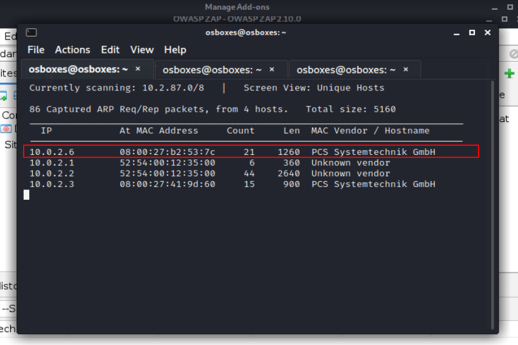


### NMAP


```bash
sudo nmap -A -sN -v -Pn -p- 10.0.2.6
```

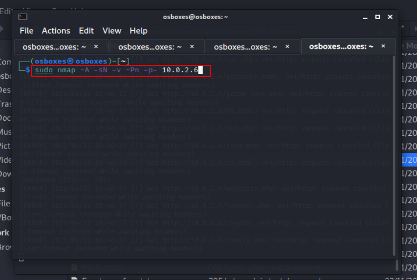


#### OUTPUT

```
$ sudo nmap -A -sN -v -Pn -p- 10.0.2.6
[sudo] password for osboxes: 
Host discovery disabled (-Pn). All addresses will be marked 'up' and scan times will be slower.
Starting Nmap 7.91 ( https://nmap.org ) at 2021-04-12 10:46 EDT
NSE: Loaded 153 scripts for scanning.
NSE: Script Pre-scanning.
Initiating NSE at 10:46
Completed NSE at 10:46, 0.00s elapsed
Initiating NSE at 10:46
Completed NSE at 10:46, 0.00s elapsed
Initiating NSE at 10:46
Completed NSE at 10:46, 0.00s elapsed
Initiating ARP Ping Scan at 10:46
Scanning 10.0.2.6 [1 port]
Completed ARP Ping Scan at 10:46, 0.02s elapsed (1 total hosts)
Initiating Parallel DNS resolution of 1 host. at 10:46
Completed Parallel DNS resolution of 1 host. at 10:46, 0.00s elapsed
Initiating NULL Scan at 10:46
Scanning 10.0.2.6 [65535 ports]
Completed NULL Scan at 10:46, 5.50s elapsed (65535 total ports)
Initiating Service scan at 10:47
Scanning 25 services on 10.0.2.6
Discovered open port 21/tcp on 10.0.2.6
Discovered open|filtered port 21/tcp on 10.0.2.6 is actually open
Discovered open port 22/tcp on 10.0.2.6
Discovered open|filtered port 22/tcp on 10.0.2.6 is actually open
Discovered open port 80/tcp on 10.0.2.6
Discovered open|filtered port 80/tcp on 10.0.2.6 is actually open
Discovered open port 110/tcp on 10.0.2.6
Discovered open|filtered port 110/tcp on 10.0.2.6 is actually open
Discovered open port 111/tcp on 10.0.2.6
Discovered open|filtered port 111/tcp on 10.0.2.6 is actually open
Discovered open port 139/tcp on 10.0.2.6
Discovered open|filtered port 139/tcp on 10.0.2.6 is actually open
Discovered open port 143/tcp on 10.0.2.6
Discovered open|filtered port 143/tcp on 10.0.2.6 is actually open
Discovered open port 443/tcp on 10.0.2.6
Discovered open|filtered port 443/tcp on 10.0.2.6 is actually open
Discovered open port 445/tcp on 10.0.2.6
Discovered open|filtered port 445/tcp on 10.0.2.6 is actually open
Discovered open port 901/tcp on 10.0.2.6
Discovered open|filtered port 901/tcp on 10.0.2.6 is actually open
Discovered open port 993/tcp on 10.0.2.6
Discovered open|filtered port 993/tcp on 10.0.2.6 is actually open
Discovered open port 995/tcp on 10.0.2.6
Discovered open|filtered port 995/tcp on 10.0.2.6 is actually open
Discovered open port 3306/tcp on 10.0.2.6
Discovered open|filtered port 3306/tcp on 10.0.2.6 is actually open
Discovered open port 5801/tcp on 10.0.2.6
Discovered open|filtered port 5801/tcp on 10.0.2.6 is actually open
Discovered open port 5802/tcp on 10.0.2.6
Discovered open|filtered port 5802/tcp on 10.0.2.6 is actually open
Discovered open port 5803/tcp on 10.0.2.6
Discovered open|filtered port 5803/tcp on 10.0.2.6 is actually open
Discovered open port 5804/tcp on 10.0.2.6
Discovered open|filtered port 5804/tcp on 10.0.2.6 is actually open
Discovered open port 5901/tcp on 10.0.2.6
Discovered open|filtered port 5901/tcp on 10.0.2.6 is actually open
Discovered open port 5902/tcp on 10.0.2.6
Discovered open|filtered port 5902/tcp on 10.0.2.6 is actually open
Discovered open port 5903/tcp on 10.0.2.6
Discovered open|filtered port 5903/tcp on 10.0.2.6 is actually open
Discovered open port 5904/tcp on 10.0.2.6
Discovered open|filtered port 5904/tcp on 10.0.2.6 is actually open
Discovered open port 6001/tcp on 10.0.2.6
Discovered open|filtered port 6001/tcp on 10.0.2.6 is actually open
Discovered open port 6002/tcp on 10.0.2.6
Discovered open|filtered port 6002/tcp on 10.0.2.6 is actually open
Discovered open port 6003/tcp on 10.0.2.6
Discovered open|filtered port 6003/tcp on 10.0.2.6 is actually open
Discovered open port 6004/tcp on 10.0.2.6
Discovered open|filtered port 6004/tcp on 10.0.2.6 is actually open
Completed Service scan at 10:49, 143.02s elapsed (25 services on 1 host)
Initiating OS detection (try #1) against 10.0.2.6
NSE: Script scanning 10.0.2.6.
Initiating NSE at 10:49
NSE: [ftp-bounce] PORT response: 500 Illegal PORT command.
Completed NSE at 10:49, 33.68s elapsed
Initiating NSE at 10:49
Completed NSE at 10:50, 5.28s elapsed
Initiating NSE at 10:50
Completed NSE at 10:50, 0.01s elapsed
Nmap scan report for 10.0.2.6
Host is up (0.00042s latency).
Not shown: 65510 closed ports
PORT     STATE SERVICE      VERSION
21/tcp   open  ftp          vsftpd 2.0.5
| ftp-anon: Anonymous FTP login allowed (FTP code 230)
|_drwxr-xr-x    2 0        0            4096 Jun 05  2013 pub
| ftp-syst: 
|   STAT: 
| FTP server status:
|      Connected to 10.0.2.4
|      Logged in as ftp
|      TYPE: ASCII
|      No session bandwidth limit
|      Session timeout in seconds is 300
|      Control connection is plain text
|      Data connections will be plain text
|      At session startup, client count was 2
|      vsFTPd 2.0.5 - secure, fast, stable
|_End of status
22/tcp   open  ssh          OpenSSH 4.3 (protocol 2.0)
| ssh-hostkey: 
|   1024 5e:ca:64:f0:7f:d2:1a:a2:86:c6:1f:c2:2a:b3:6b:27 (DSA)
|_  2048 a3:39:2d:9f:66:96:0d:82:ad:52:1f:a1:dc:b1:f1:54 (RSA)
80/tcp   open  http         Apache httpd 2.2.3 ((CentOS))
|_http-favicon: Drupal CMS
| http-git: 
|   10.0.2.6:80/.git/
|     Git repository found!
|     Repository description: Unnamed repository; edit this file 'description' to name the...
|_    Last commit message: initial commit 
| http-methods: 
|_  Supported Methods: GET HEAD POST OPTIONS
| http-robots.txt: 36 disallowed entries (15 shown)
| /includes/ /misc/ /modules/ /profiles/ /scripts/ 
| /sites/ /themes/ /CHANGELOG.txt /cron.php /INSTALL.mysql.txt 
| /INSTALL.pgsql.txt /install.php /INSTALL.txt /LICENSE.txt 
|_/MAINTAINERS.txt
|_http-server-header: Apache/2.2.3 (CentOS)
|_http-title: LAMPSecurity Research
110/tcp  open  pop3         Dovecot pop3d
|_pop3-capabilities: TOP RESP-CODES SASL(PLAIN) STLS UIDL USER PIPELINING CAPA
|_ssl-date: 2021-04-12T23:47:57+00:00; +8h57m56s from scanner time.
| sslv2: 
|   SSLv2 supported
|   ciphers: 
|     SSL2_RC4_128_EXPORT40_WITH_MD5
|     SSL2_DES_192_EDE3_CBC_WITH_MD5
|     SSL2_RC4_128_WITH_MD5
|     SSL2_RC2_128_CBC_EXPORT40_WITH_MD5
|_    SSL2_RC2_128_CBC_WITH_MD5
111/tcp  open  rpcbind      2 (RPC #100000)
| rpcinfo: 
|   program version    port/proto  service
|   100000  2            111/tcp   rpcbind
|   100000  2            111/udp   rpcbind
|   100024  1            898/udp   status
|_  100024  1            901/tcp   status
139/tcp  open  netbios-ssn?
143/tcp  open  imap         Dovecot imapd
|_imap-capabilities: SASL-IR AUTH=PLAINA0001 Capability THREAD=REFERENCES LITERAL+ SORT completed NAMESPACE STARTTLS MULTIAPPEND IDLE OK UNSELECT LOGIN-REFERRALS IMAP4rev1 CHILDREN
|_ssl-date: 2021-04-12T23:47:57+00:00; +8h57m55s from scanner time.
443/tcp  open  ssl/https?
| ssl-cert: Subject: commonName=localhost.localdomain/organizationName=SomeOrganization/stateOrProvinceName=SomeState/countryName=--
| Issuer: commonName=localhost.localdomain/organizationName=SomeOrganization/stateOrProvinceName=SomeState/countryName=--
| Public Key type: rsa
| Public Key bits: 1024
| Signature Algorithm: sha1WithRSAEncryption
| Not valid before: 2013-05-29T19:38:35
| Not valid after:  2014-05-29T19:38:35
| MD5:   bb74 1bd6 4c28 3cf9 c834 cb84 f40d 061b
|_SHA-1: 455a b0b0 ef74 9949 bf38 bc63 b0fd f1e7 efcb b893
|_ssl-date: 2021-04-12T23:47:55+00:00; +8h57m55s from scanner time.
445/tcp  open  microsoft-ds Samba smbd 3.0.33-3.7.el5
901/tcp  open  status       1 (RPC #100024)
993/tcp  open  ssl/imaps?
| ssl-cert: Subject: commonName=imap.example.com
| Issuer: commonName=imap.example.com
| Public Key type: rsa
| Public Key bits: 1024
| Signature Algorithm: sha1WithRSAEncryption
| Not valid before: 2013-05-29T19:38:44
| Not valid after:  2014-05-29T19:38:44
| MD5:   ea5e dc5a 30c4 9441 faf3 ea7b cf09 e1c9
|_SHA-1: 4a7e 6391 3745 cc0e 5fc9 5627 9845 7895 0cda 7be3
|_ssl-date: 2021-04-12T23:47:56+00:00; +8h57m56s from scanner time.
| sslv2: 
|   SSLv2 supported
|   ciphers: 
|     SSL2_RC4_128_EXPORT40_WITH_MD5
|     SSL2_DES_192_EDE3_CBC_WITH_MD5
|     SSL2_RC4_128_WITH_MD5
|     SSL2_RC2_128_CBC_EXPORT40_WITH_MD5
|_    SSL2_RC2_128_CBC_WITH_MD5
995/tcp  open  ssl/pop3s?
| ssl-cert: Subject: commonName=imap.example.com
| Issuer: commonName=imap.example.com
| Public Key type: rsa
| Public Key bits: 1024
| Signature Algorithm: sha1WithRSAEncryption
| Not valid before: 2013-05-29T19:38:44
| Not valid after:  2014-05-29T19:38:44
| MD5:   ea5e dc5a 30c4 9441 faf3 ea7b cf09 e1c9
|_SHA-1: 4a7e 6391 3745 cc0e 5fc9 5627 9845 7895 0cda 7be3
|_ssl-date: 2021-04-12T23:47:55+00:00; +8h57m55s from scanner time.
| sslv2: 
|   SSLv2 supported
|   ciphers: 
|     SSL2_RC4_128_EXPORT40_WITH_MD5
|     SSL2_DES_192_EDE3_CBC_WITH_MD5
|     SSL2_RC4_128_WITH_MD5
|     SSL2_RC2_128_CBC_EXPORT40_WITH_MD5
|_    SSL2_RC2_128_CBC_WITH_MD5
3306/tcp open  mysql        MySQL (unauthorized)
5801/tcp open  vnc-http     RealVNC 4.0 (resolution: 400x250; VNC TCP port: 5901)
| http-methods: 
|_  Supported Methods: GET HEAD
|_http-server-header: RealVNC/4.0
|_http-title: VNC viewer for Java
5802/tcp open  vnc-http     RealVNC 4.0 (resolution: 400x250; VNC TCP port: 5902)
| http-methods: 
|_  Supported Methods: GET HEAD
|_http-server-header: RealVNC/4.0
|_http-title: VNC viewer for Java
5803/tcp open  vnc-http-3?
| fingerprint-strings: 
|   Help, SSLSessionReq, TLSSessionReq, TerminalServerCookie: 
|     HTTP/1.1 400 Bad Request
|     Server: RealVNC/4.0
|     Date: Mon, 12 Apr 2021 23:45:36 GMT
|     Last-Modified: Mon, 12 Apr 2021 23:45:36 GMT
|     Connection: close
|     Content-Type: text/html
|     <!DOCTYPE HTML PUBLIC "-//IETF//DTD HTML 2.0//EN">
|     <HTML><HEAD>
|     <TITLE>400 Bad Request</TITLE>
|     </HEAD><BODY><H1>
|     Request
|_    </H1></BODY></HTML>
5804/tcp open  vnc-http     RealVNC 4.0 (resolution: 400x250; VNC TCP port: 5904)
| http-methods: 
|_  Supported Methods: GET HEAD
|_http-server-header: RealVNC/4.0
|_http-title: VNC viewer for Java
5901/tcp open  vnc          VNC (protocol 3.8)
| vnc-info: 
|   Protocol version: 3.8
|   Security types: 
|_    VNC Authentication (2)
5902/tcp open  vnc          VNC (protocol 3.8)
| vnc-info: 
|   Protocol version: 3.8
|   Security types: 
|_    VNC Authentication (2)
5903/tcp open  vnc          VNC (protocol 3.8)
| vnc-info: 
|   Protocol version: 3.8
|   Security types: 
|_    VNC Authentication (2)
5904/tcp open  vnc          VNC (protocol 3.8)
| vnc-info: 
|   Protocol version: 3.8
|   Security types: 
|_    VNC Authentication (2)
6001/tcp open  X11          (access denied)
6002/tcp open  X11:2?
6003/tcp open  X11:3?
6004/tcp open  X11          (access denied)
1 service unrecognized despite returning data. If you know the service/version, please submit the following fingerprint at https://nmap.org/cgi-bin/submit.cgi?new-service :
SF-Port5803-TCP:V=7.91%I=7%D=4/12%Time=60745D8D%P=x86_64-pc-linux-gnu%r(He
SF:lp,147,"HTTP/1\.1\x20400\x20Bad\x20Request\r\nServer:\x20RealVNC/4\.0\r
SF:\nDate:\x20Mon,\x2012\x20Apr\x202021\x2023:45:36\x20GMT\r\nLast-Modifie
SF:d:\x20Mon,\x2012\x20Apr\x202021\x2023:45:36\x20GMT\r\nConnection:\x20cl
SF:ose\r\nContent-Type:\x20text/html\r\n\r\n<!DOCTYPE\x20HTML\x20PUBLIC\x2
SF:0\"-//IETF//DTD\x20HTML\x202\.0//EN\">\r\n<HTML><HEAD>\r\n<TITLE>400\x2
SF:0Bad\x20Request</TITLE>\r\n</HEAD><BODY><H1>\r\nBad\x20Request\r\n</H1>
SF:</BODY></HTML>\r\n")%r(SSLSessionReq,147,"HTTP/1\.1\x20400\x20Bad\x20Re
SF:quest\r\nServer:\x20RealVNC/4\.0\r\nDate:\x20Mon,\x2012\x20Apr\x202021\
SF:x2023:45:36\x20GMT\r\nLast-Modified:\x20Mon,\x2012\x20Apr\x202021\x2023
SF::45:36\x20GMT\r\nConnection:\x20close\r\nContent-Type:\x20text/html\r\n
SF:\r\n<!DOCTYPE\x20HTML\x20PUBLIC\x20\"-//IETF//DTD\x20HTML\x202\.0//EN\"
SF:>\r\n<HTML><HEAD>\r\n<TITLE>400\x20Bad\x20Request</TITLE>\r\n</HEAD><BO
SF:DY><H1>\r\nBad\x20Request\r\n</H1></BODY></HTML>\r\n")%r(TerminalServer
SF:Cookie,147,"HTTP/1\.1\x20400\x20Bad\x20Request\r\nServer:\x20RealVNC/4\
SF:.0\r\nDate:\x20Mon,\x2012\x20Apr\x202021\x2023:45:36\x20GMT\r\nLast-Mod
SF:ified:\x20Mon,\x2012\x20Apr\x202021\x2023:45:36\x20GMT\r\nConnection:\x
SF:20close\r\nContent-Type:\x20text/html\r\n\r\n<!DOCTYPE\x20HTML\x20PUBLI
SF:C\x20\"-//IETF//DTD\x20HTML\x202\.0//EN\">\r\n<HTML><HEAD>\r\n<TITLE>40
SF:0\x20Bad\x20Request</TITLE>\r\n</HEAD><BODY><H1>\r\nBad\x20Request\r\n<
SF:/H1></BODY></HTML>\r\n")%r(TLSSessionReq,147,"HTTP/1\.1\x20400\x20Bad\x
SF:20Request\r\nServer:\x20RealVNC/4\.0\r\nDate:\x20Mon,\x2012\x20Apr\x202
SF:021\x2023:45:36\x20GMT\r\nLast-Modified:\x20Mon,\x2012\x20Apr\x202021\x
SF:2023:45:36\x20GMT\r\nConnection:\x20close\r\nContent-Type:\x20text/html
SF:\r\n\r\n<!DOCTYPE\x20HTML\x20PUBLIC\x20\"-//IETF//DTD\x20HTML\x202\.0//
SF:EN\">\r\n<HTML><HEAD>\r\n<TITLE>400\x20Bad\x20Request</TITLE>\r\n</HEAD
SF:><BODY><H1>\r\nBad\x20Request\r\n</H1></BODY></HTML>\r\n");
MAC Address: 08:00:27:B2:53:7C (Oracle VirtualBox virtual NIC)
Device type: general purpose
Running: Linux 2.6.X
OS CPE: cpe:/o:linux:linux_kernel:2.6
OS details: Linux 2.6.9 - 2.6.30
Uptime guess: 0.033 days (since Mon Apr 12 10:03:15 2021)
Network Distance: 1 hop
TCP Sequence Prediction: Difficulty=201 (Good luck!)
IP ID Sequence Generation: All zeros
Service Info: OS: Unix

Host script results:
|_clock-skew: mean: 9h32m12s, deviation: 1h30m43s, median: 8h57m55s
| nbstat: NetBIOS name: LAMPSEC, NetBIOS user: <unknown>, NetBIOS MAC: <unknown> (unknown)
| Names:
|   LAMPSEC<00>          Flags: <unique><active>
|   LAMPSEC<03>          Flags: <unique><active>
|   LAMPSEC<20>          Flags: <unique><active>
|   \x01\x02__MSBROWSE__\x02<01>  Flags: <group><active>
|   WORKGROUP<1d>        Flags: <unique><active>
|   WORKGROUP<1e>        Flags: <group><active>
|_  WORKGROUP<00>        Flags: <group><active>
| smb-os-discovery: 
|   OS: Unix (Samba 3.0.33-3.7.el5)
|   Computer name: localhost
|   NetBIOS computer name: 
|   Domain name: localdomain
|   FQDN: localhost.localdomain
|_  System time: 2021-04-12T19:47:21-04:00
| smb-security-mode: 
|   account_used: <blank>
|   authentication_level: user
|   challenge_response: supported
|_  message_signing: disabled (dangerous, but default)
|_smb2-time: Protocol negotiation failed (SMB2)

TRACEROUTE
HOP RTT     ADDRESS
1   0.41 ms 10.0.2.6

NSE: Script Post-scanning.
Initiating NSE at 10:50
Completed NSE at 10:50, 0.00s elapsed
Initiating NSE at 10:50
Completed NSE at 10:50, 0.00s elapsed
Initiating NSE at 10:50
Completed NSE at 10:50, 0.00s elapsed
Read data files from: /usr/bin/../share/nmap
OS and Service detection performed. Please report any incorrect results at https://nmap.org/submit/ .
Nmap done: 1 IP address (1 host up) scanned in 190.79 seconds
           Raw packets sent: 65580 (2.624MB) | Rcvd: 65700 (2.681MB)
```


### Nikto


```
sudo nikto -h 10.0.2.6
```

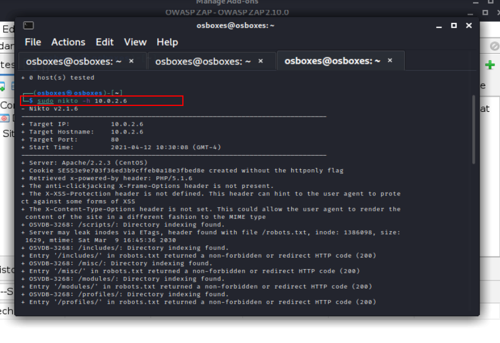

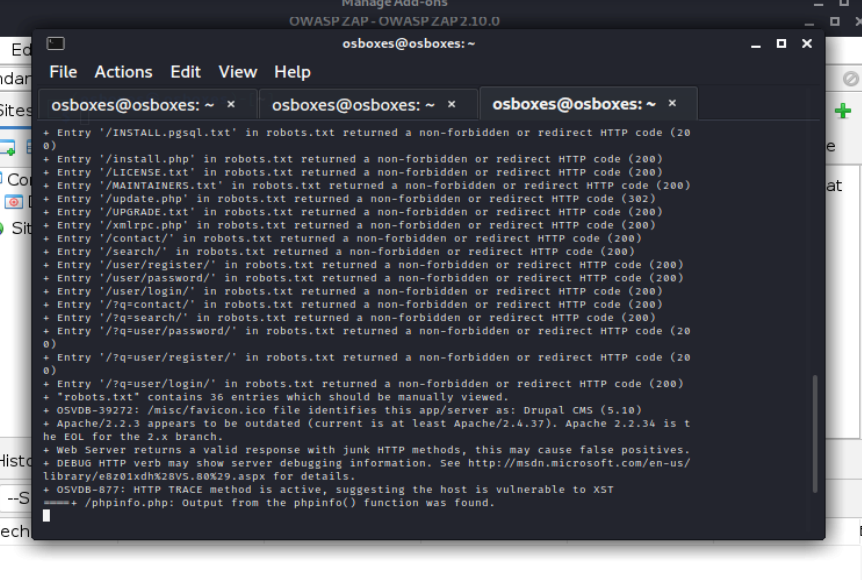

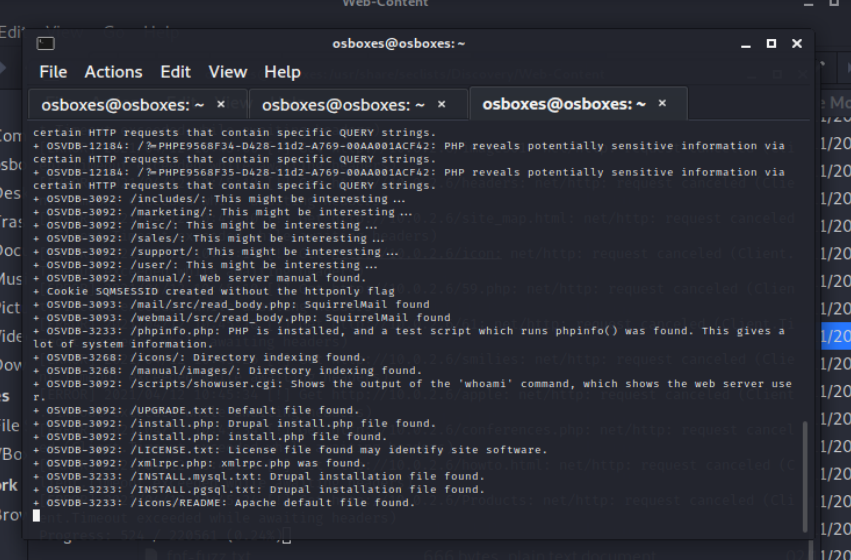


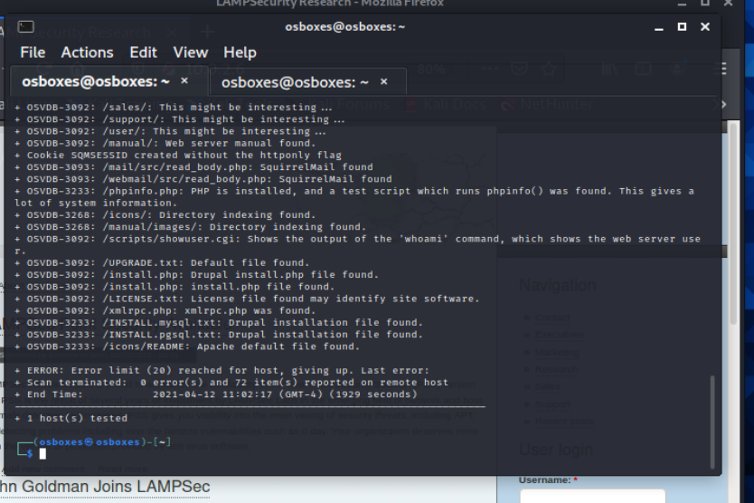


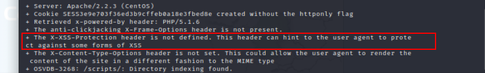

**NOTE**:  Write this information as note, for later.


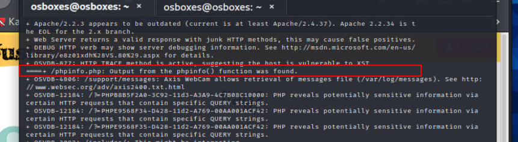

**NOTE**:  Write this information as note, for later.


### Dirb


```bash
cd /usr/share/dirb/wordlists/
```


```bash
dirb http://10.0.2.6/content -w common.txt
```


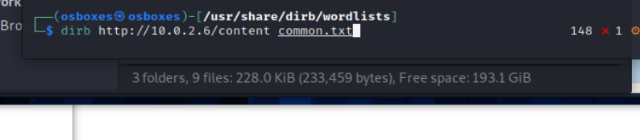


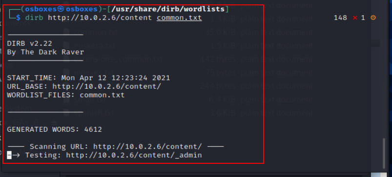


> I will let this run as I work on other things.


### 


### Website

> After detecting that Port 80 is open, that gave me first clue to go and check the IP address in the web browser and I got this ugly webpage.


#### This is the time that I decided to check the source of this page.

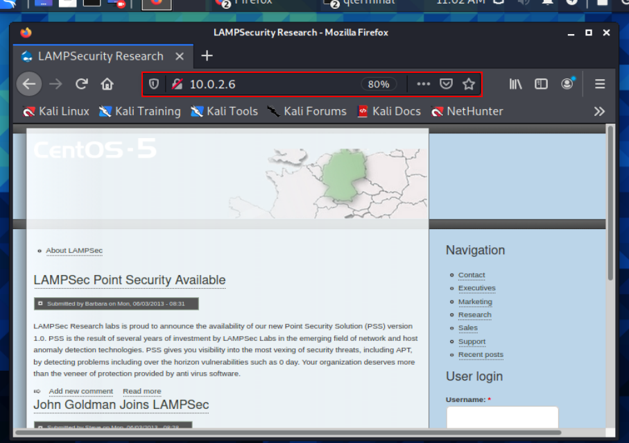


#### Clicking on a Post on the homepage

> Upon clicking on a specific post I see that am I now in the `content` folder

**NOTE**:  Write this information as note, for later.


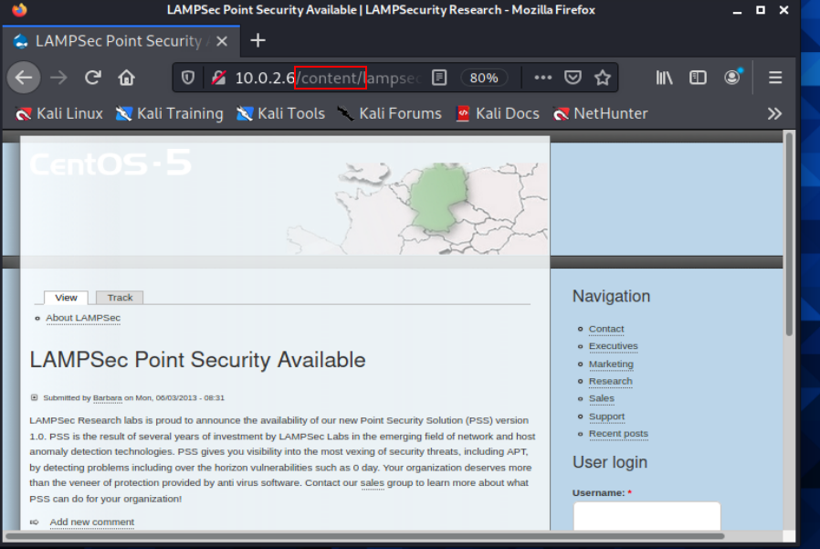

> 


#### FLAG 1

And right off the bat I see a flag.

`#flag#550e1bafe077ff0b0b67f4e32f29d751`

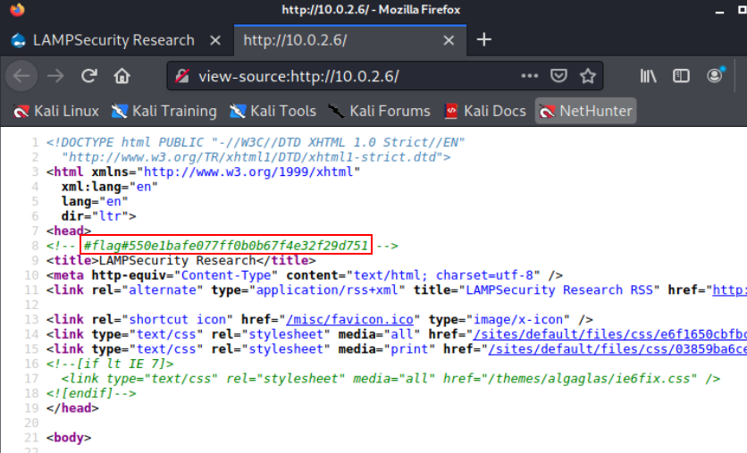 


#### Flag 2

> Now if I remembered from the nikto scan that `phpinfo.php` was found. That means if you add that after the IP address, you should be able to get that webpage.


##### phpinfo.php 

```
http://10.0.2.6/phpinfo.php
```


> And right at the top of the webpage, I get another flag.

`#flag#550e1bafe077ff0b0b67f4e32f29d751`


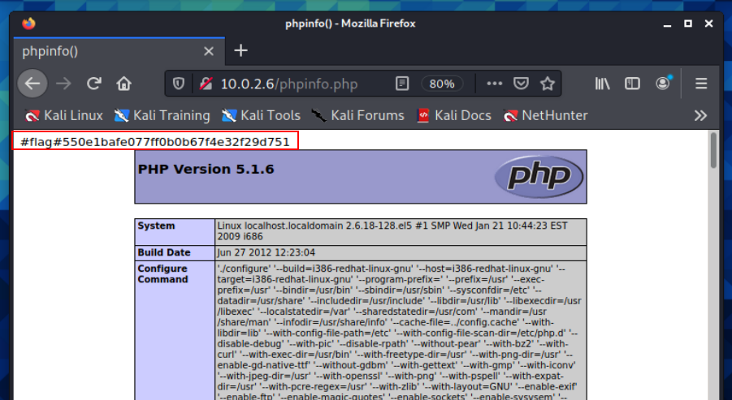


#### Flag 3

> 


`#flag#57dbe55b42b307fb4115146d239955d0`


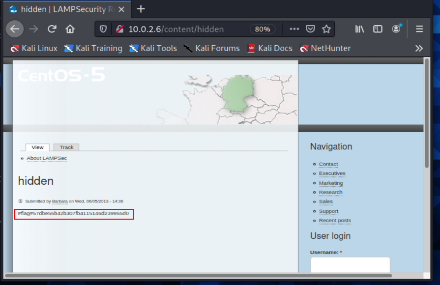


#### Create Logon

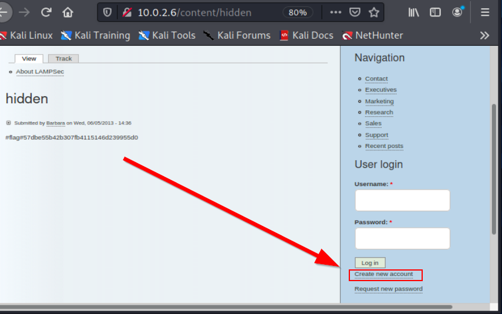


### Start HTTP Server


```python
python -m http.server 80
```


